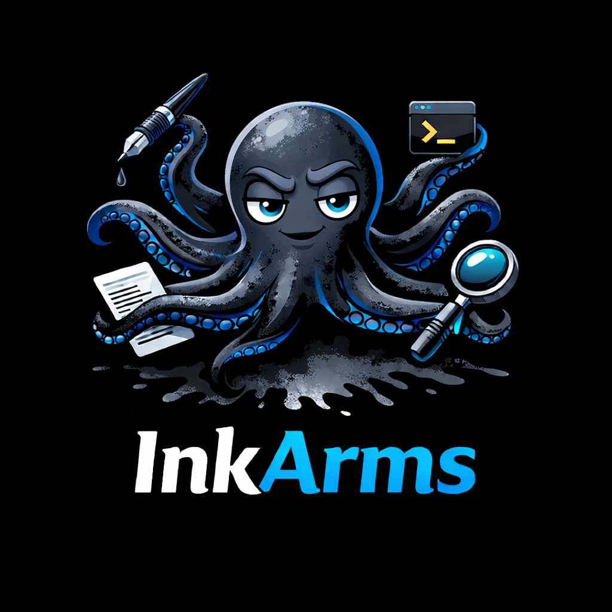
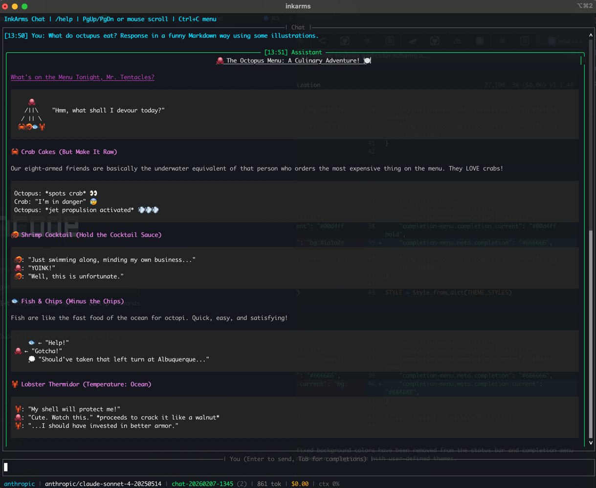

# 🐙 InkArms

<p align="center">
  <em>The AI Agent with 8 Arms, Infinite Ink, and Zero Intent to Destroy Your Filesystem.</em>
</p>

<p align="center">
  <picture>
    
  </picture>
</p>

<p align="center">
  <a href="https://github.com/digitalzany/inkarms/actions"></a>
  <a href="https://github.com/digitalzany/inkarms/blob/main/LICENSE"></a>
  <a href="https://github.com/astral-sh/ruff"></a>
</p>

---

## 🌊 What is this thing?

**InkArms** is an AI Agent CLI that acts like an octopus: it has a central brain (the LLM) but uses independent **arms** (Tools) to get stuff done.

Most AI tools are just chatboxes. They talk a big game but can't *do* anything. InkArms is different. It doesn't just hallucinate code; it **runs it** (safely), **tests it**, **commits it**, and then **tells you about it** on Slack.

> **Philosophy:** InkArms doesn't "chat." It **acts**, **remembers**, and **leaves a paper trail**.

<p align="center">
  <picture>
    
  </picture>
</p>

## ✨ Why InkArms?

| Feature |       Standard Chatbot 🤖       | InkArms 🐙 |
| :--- |:-------------------------------:| :---: |
| **Execution** | "Here is some code (good luck)" | "I ran the code. It failed. I fixed it. It works now." |
| **Memory** | Forgets you after context limit | **Persistent Memory** & Handoffs. It remembers. |
| **Security** |          None or weak           | **Sandbox**, Whitelists, & Audit Logs. |
| **Reach** |        Browser Tab, CLI         | **CLI, TUI, Telegram, Slack, Discord**. |
| **Vibe** |       Corporate & Sterile       | **Cephalopod Chaos (Controlled)**. |

## 🛡️ Safe by Design (The "No Skynet" Promise)

We know giving an AI access to your terminal sounds like the start of a sci-fi horror movie. That's why InkArms is built with **paranoia-first security**:

1.  **The Sandbox 📦:** All commands run in a restricted execution environment. `rm -rf /` is not just discouraged; it's physically impossible in default modes.
2.  **The Bouncer (Whitelist) 📋:** By default, InkArms only knows a handful of safe moves (`ls`, `cat`, `git status`). You have to explicitly teach it dangerous moves.
3.  **The Paper Trail (Audit Logs) 🕵️:** Every single action—every file read, every command run, every API call—is logged to a local, immutable JSONL ledger. You can replay the entire crime scene (or success story).
4.  **Local Secrets 🔐:** Your API keys are encrypted at rest on your machine using Fernet symmetric encryption. We don't see them. The AI doesn't see them until the millisecond it needs them.

## 🚀 Quick Start

### 1. Install (The Easy Part)

```bash
# Get the core
pip install inkarms

# Get the superpowers (Telegram, Slack, Discord support)
pip install "inkarms[platforms]"
```

### 2. Wake the Kraken

```bash
# Initialize your config (and secrets)
inkarms config init
```

The interactive wizard allows you to:
- **Quick Start**: Set up with sensible defaults (Provider + API Key).
- **Advanced Setup**: Configure security, tools, and more detailed options.
- **Skip**: Skip setup to configure manually via `~/.inkarms/config.yaml`.

```bash
# Interactive mode (menu, chat, dashboard, sessions - it's pretty)
inkarms

# One-off command
inkarms run "Check the git status of this repo and summarize the last 5 commits" --tools
```

### 3. Connect the Tentacles (Messaging)

Want to chat with your agent from the grocery store? InkArms supports **polling** and **sockets**, meaning **NO static IP** and **NO webhooks** required.

```bash
# 1. Set your bot token
inkarms config set-secret telegram-bot-token

# 2. Start the bridge
inkarms platforms start
```

*Boom. You're now debugging your server from Telegram.*

## 🧠 Features

### 🛠️ The Arms (Tools)
InkArms comes with batteries included:
*   **Bash:** Execute shell commands (safely).
*   **File Ops:** Read, write, and search files (with encoding smarts).
*   **Git:** Clone, commit, diff, and log.
*   **Python:** Run safe, sandboxed Python snippets for math/logic.
*   **HTTP:** Browse the web, hit APIs.

### 🧩 The Skills
Teach InkArms new tricks using **Skill Files** (`SKILL.md` + `skill.yaml`). It's like `docker-compose` for AI capabilities.
```bash
inkarms skill install github:inkarms/skills/security-scan
inkarms run "Audit this directory" --skill security-scan
```

### 📝 Persistent Memory & Context
Unlike standard LLM scripts that forget you instantly, InkArms keeps track of your conversation.
*   **Auto-Compaction:** Automatically summarizes old context to save tokens while keeping the "gist".
*   **Handoffs:** Saves state to `HANDOFF.md` when things get too complex, allowing you to "reboot" the agent with fresh context but full history.
*   **Session Logs:** Every session is saved to a local SQLite database or file for later review.

### 🖥️ Interactive UI & Wizard
We believe terminal tools should be pretty.
*   **Interactive Setup:** `inkarms config init` runs a wizard that guides you through provider selection and security settings.
*   **Full UI:** `inkarms` launches an interactive terminal app with menu, chat, dashboard, session management, streaming responses, syntax highlighting, and real-time tool execution status. Built with Rich + prompt_toolkit, with a pluggable backend system.

### 🔌 Provider Agnostic (LiteLLM)
Don't get locked into one vendor. InkArms sits on top of [LiteLLM](https://github.com/BerriAI/litellm), giving you instant access to 100+ models.
*   **Switch Instantly:** `inkarms run "query" --model ollama/llama3` or `--model anthropic/claude-3-opus`.
*   **Smart Fallbacks:** If OpenAI is down, automatically fail over to Anthropic or Azure.
*   **Cost Tracking:** See exactly how much each command costs before you run it (optional).

## 📚 Documentation

Detailed documentation is available in the `docs/` directory:

- [**User Guide**](docs/user_guide.md) — Getting started
- [**UI Guide**](docs/tui_guide.md) — Interactive interface, chat & config wizard
- [**Platform Setup**](docs/platforms.md) — Telegram, Slack, Discord
- [**Advanced Tools**](docs/advanced_tool_use.md) — HTTP, Python, Git
- [**Security & Sandbox**](docs/security.md) — Safety features
- [**Configuration**](docs/configuration.md) — Settings reference
- [**Skill Authoring**](docs/skill_authoring.md) — Create skills
- [**CLI Reference**](docs/cli_reference.md) — Command list

## 🗺️ Roadmap

- [x] **Phase 1: Foundation** (Config, Providers, Basic Tools, TUI, Platforms) ✅
- [ ] **Phase 2: Intelligence** (Deep Thinking, Auto-Routing, Plugin System) 🚧
- [ ] **Phase 3: Ecosystem** (Skill Marketplace, Team Profiles)
- [ ] **Phase 4: Global Domination** (Just kidding. Maybe.)

## 🤝 Contributing

We welcome all contributors! Whether you have 2 arms or 8.

```bash
git clone https://github.com/digitalzany/inkarms.git
cd inkarms
pip install -e ".[dev]"
pytest  # If the tests pass, you may pass.
```

## 📄 License

MIT. Do whatever you want, just don't blame us if your octopus learns to trade crypto.

---
<p align="center">
  <em>"I don't chat. I act." — InkArms</em>
</p>
