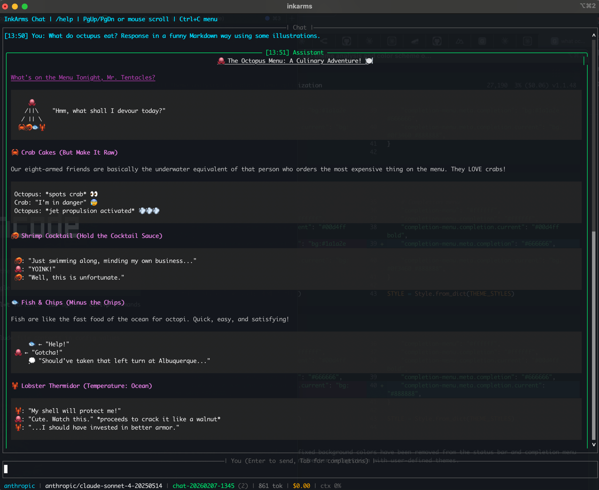

# 🐙 InkArms

<p align="center">
  <em>The AI Agent with 8 Arms, Infinite Ink, and Zero Intent to Destroy Your Filesystem.</em>
</p>

<p align="center">
  <picture>
    
  </picture>
</p>

<p align="center">
  <a href="https://github.com/digitalzany/inkarms/actions"></a>
  <a href="https://github.com/digitalzany/inkarms/blob/main/LICENSE"></a>
  <a href="https://github.com/astral-sh/ruff"></a>
</p>

---

## 🌊 What is this thing?

**InkArms** is an AI Agent CLI that acts like an octopus: it has a central brain (the LLM) but uses independent **arms** (Tools) to get stuff done.

Most AI tools are just chatboxes. They talk a big game but can't *do* anything. InkArms is different. It doesn't just hallucinate code; it **runs it** (safely), **tests it**, **commits it**, and then **tells you about it** on Slack.

> **Philosophy:** InkArms doesn't "chat." It **acts**, **remembers**, and **leaves a paper trail**.

<p align="center">
  <picture>
    
  </picture>
</p>

---

## ✨ What You Get

| Subsystem | What it does |
| :--- | :--- |
| 🛠️ **Tools** | Bash, File, Git, HTTP, Python, Web Search — all sandboxed |
| 🧩 **Skills** | Portable `SKILL.md` instruction sets, keyword auto-discovery |
| 🧠 **Memory** | Context compaction, handoffs, session persistence |
| 🔌 **Providers** | 100+ models via LiteLLM, fallback chains, per-session cost tracking |
| 🏠 **Hub** | Always-on daemon: REST + WebSocket API, cron jobs, webhook triggers, OpenAI proxy |
| 🌐 **Platforms** | Telegram, Slack, Discord via Hub — polling/WebSocket, no webhook or static IP needed |
| 🛡️ **Security** | Sandbox, blacklist/whitelist, immutable audit log, encrypted secrets |

---

## 🚀 Quick Start

### 1. Install

```bash
pip install "inkarms[all]"
```

### 2. Initialize

```bash
inkarms config init        # Interactive setup wizard (choose provider, API key, security)
inkarms  # runs CLI tool
inkarms hub start --background  # runs hub with all features in background
```

### 3. Interactive UI

```bash
inkarms    # Full TUI: chat, dashboard, sessions, config wizard
```

Built with Rich + prompt_toolkit. Streaming responses, tool execution panels, slash commands (`/model`, `/agent`, `/tools`, `/compact`...).

### 4. Hub (daemon) + messangers

Enable the required messenger in your config (~/.inkarms/config.yaml), then:

```bash
inkarms hub start --background                  # Hub auto-starts all enabled platforms
```

Now you've got a REST + WebSocket API, scheduled AI jobs, and always-on platform adapters.
→ [Hub Setup Guide](docs/hub.md)

Your agent is reachable through different messengers: Telegram, Slack, Discord and more coming. No webhook. No static IP. No excuses.
All configured platforms are available after hub start. Or you can run platforms separately if you don't need hub features.

→ [Platform Setup Guide](docs/platforms.md)

---

## 🛡️ Security (The "No Skynet" Promise)

Giving an AI a terminal sounds terrifying. InkArms takes that seriously:

- **Sandbox 📦** — Commands run through a restricted executor. Default mode: blacklist. `rm -rf /` hits a wall.
- **Whitelist/Blacklist 📋** — You define what's allowed. The defaults block `sudo`, `curl | bash`, `chmod`, sensitive paths, and [a lot more](docs/security.md).
- **Audit Log 🕵️** — Every action — tool calls, approvals, denials, platform messages — written to a local JSONL ledger. Immutable. Rotated. Compressed.
- **Encrypted Secrets 🔐** — API keys stored with Fernet encryption. `inkarms config set-secret anthropic` and they're never in plaintext again.
- **Tool Approval 🙋** — Dangerous tools prompt inline in chat: `a` allow, `d` deny, `A` allow all for the session.

```bash
# See what InkArms is doing
cat ~/.inkarms/audit/audit.jsonl | jq .

# Tighten down what bash can run
inkarms config set security.sandbox.mode whitelist
inkarms config set security.whitelist '["ls","cat","git","python"]'
```

→ [Security Reference](docs/security.md)

---

## 🛠️ Tools

InkArms comes with batteries:

| Tool | Dangerous? | Requires |
| :--- | :---: | :--- |
| **Bash** — Shell execution (sandboxed) | ✅ | Bundled |
| **File** — Read, write, list files | Partial | Bundled |
| **Search** — Glob pattern + content search | ❌ | Bundled |
| **HTTP** — GET/POST/PUT/DELETE, auth, JSON | ❌ | Bundled |
| **Python** — Safe sandboxed snippets | ✅ | `RestrictedPython` |
| **Git** — Status, log, diff, add, commit, branch | ✅ | `GitPython` |
| **Web Search** — Brave Search API | ❌ | Brave API key |

Enable tools per-run or globally:

```bash
inkarms run "Fix the failing test" --tools --tool-approval auto
```

→ [Advanced Tool Use](docs/advanced_tool_use.md)

---

## 🧩 Skills

Skills are portable instruction sets that teach InkArms how to handle specific tasks — think of them as `docker-compose` for AI capabilities, but smaller.

Each skill is a directory with two files:

```
~/.inkarms/skills/code-review/
├── skill.yaml   # name, version, keywords, permissions
└── SKILL.md     # instructions for the AI
```

```bash
# Create a skill from template
inkarms skill create code-review

# Load it explicitly
inkarms run "Review this PR" --skill code-review

# Or let InkArms auto-discover based on your query
inkarms run "Check this Python code for security issues" --auto-skill

# Install from a local directory
inkarms skill install ./my-local-skill
```

Skills live in `~/.inkarms/skills/` (global) or `.inkarms/skills/` (project-local). Project-local skills take precedence.

→ [Skill Authoring Guide](docs/skill_authoring.md)

---

## 🧠 Memory & Context

InkArms remembers your sessions and can pick up where you left off.

```bash
inkarms memory status       # Context usage: 45,000/128,000 (35.2%)
inkarms memory compact      # Summarize old context to save tokens
inkarms memory handoff      # Save state to HANDOFF.md (for fresh-context restarts)
inkarms memory recover      # Reload from handoff
inkarms memory snapshot auth-design   # Pin a named checkpoint
```

Context is automatically compacted when it hits 70% of the window. Three strategies available: `summarize` (AI-generated summary), `truncate`, or `sliding_window`.

→ [User Guide — Memory](docs/user_guide.md#memory--context)

---

## 🔌 Providers (100+ Models)

InkArms rides [LiteLLM](https://github.com/BerriAI/litellm), which means you're not locked into anything:

```bash
# One-off model selection
inkarms run "Haiku about Python" --model openai/gpt-4
inkarms run "Complex refactor" --model anthropic/claude-opus-4-20250514
inkarms run "Quick check" --model ollama/llama3.1    # Fully local

# Define aliases in config
# providers.aliases.fast = "openai/gpt-3.5-turbo"
inkarms run "Fast thing" --model fast
```

```yaml
# ~/.inkarms/config.yaml
providers:
  default: "anthropic/claude-sonnet-4-20250514"
  fallback:
    - "openrouter/anthropic/claude-sonnet-4-20250514"
    - "openai/gpt-4"
  aliases:
    fast: "openai/gpt-3.5-turbo"
    local: "ollama/llama3.1"
  # Fetch the live model list from each provider's API on startup
  # and merge newly-discovered models into ~/.inkarms/providers.yaml.
  # Disabled by default — enable in the config wizard if you want the full catalogue.
  auto_discover_models: false
```

If OpenAI is down, it falls over to the next provider automatically. Costs are tracked per session and visible in the status bar.

---

## 🏠 Hub — Always-On Daemon

Run InkArms as a persistent background service with a full REST + WebSocket API.

```
                     ┌─────────────┐
  Telegram ──────────┤             ├──────► Agent Loop
  Slack    ──────────┤  InkArms    ├──────► Tool Execution
  Discord  ──────────┤    Hub      ├──────► Session Memory
  REST API ──────────┤             ├──────► Budget Tracker
  WebSocket Chat ────┤  :18750     ├──────► Cron Scheduler
                     └─────────────┘
```

```bash
inkarms hub start --background          # Start daemon
inkarms hub status                      # Running on 127.0.0.1:18750 — uptime=42s
inkarms hub install                     # Install as system service (auto-start at login)
inkarms hub logs --follow               # Tail the log
inkarms hub key                         # Show API key
```

**What the Hub gives you:**

| Feature | Details |
| :--- | :--- |
| **Always-on platforms** | Telegram/Slack/Discord stay running without manual `inkarms platforms start` |
| **REST API** | `GET /api/sessions`, `GET /api/status`, `GET /api/budget` and more |
| **WebSocket chat** | Streaming chat with full tool execution at `/ws/chat/{session_id}` |
| **Cron jobs** | Schedule bash commands or AI queries — `POST /api/cron` |
| **Webhook triggers** | Fire AI actions from GitHub, CI, or any HTTP source — `POST /triggers/{name}` |
| **OpenAI proxy** | Drop-in `/v1/chat/completions` for Continue.dev, Open WebUI, etc. |
| **Budget enforcement** | Daily cost limits with zero-latency in-memory enforcement |

Authentication: Bearer token (`Authorization: Bearer <key>`) or `X-InkArms-Key: <key>`. Localhost is trusted by default.

→ [Hub Reference](docs/hub.md) | [Trigger Routes](docs/hub-triggers.md) | [Cron Jobs](docs/hub-cron.md) | [Platform Setup](docs/platforms.md)

---

## 📚 Documentation

- [**User Guide**](docs/user_guide.md) — Getting started, CLI overview, memory, skills
- [**UI Guide**](docs/tui_guide.md) — Interactive interface walkthrough
- [**Platform Setup**](docs/platforms.md) — Telegram, Slack, Discord step-by-step
- [**Hub Daemon**](docs/hub.md) — Always-on daemon, REST API, WebSocket chat
- [**Hub Triggers**](docs/hub-triggers.md) — Webhook trigger routes
- [**Hub Cron Jobs**](docs/hub-cron.md) — Scheduled bash and AI jobs
- [**Advanced Tools**](docs/advanced_tool_use.md) — HTTP, Python, Git, approval modes
- [**Security & Sandbox**](docs/security.md) — Safety features, audit log, path restrictions
- [**Configuration**](docs/configuration.md) — Full settings reference
- [**Skill Authoring**](docs/skill_authoring.md) — Create and distribute skills
- [**CLI Reference**](docs/cli_reference.md) — Every command and flag

---

## 🤝 Contributing

```bash
git clone https://github.com/digitalzany/inkarms.git
cd inkarms
pip install -e ".[all]"
pre-commit install
pytest   # If the tests pass, you may pass.
```

See [CONTRIBUTING.md](CONTRIBUTING.md) for the full guide.

## 📄 License

MIT. Do whatever you want, just don't blame us if your octopus learns to trade crypto.

---
<p align="center">
  <em>"I don't chat. I act." — InkArms</em>
</p>
